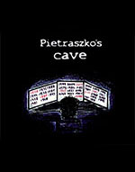
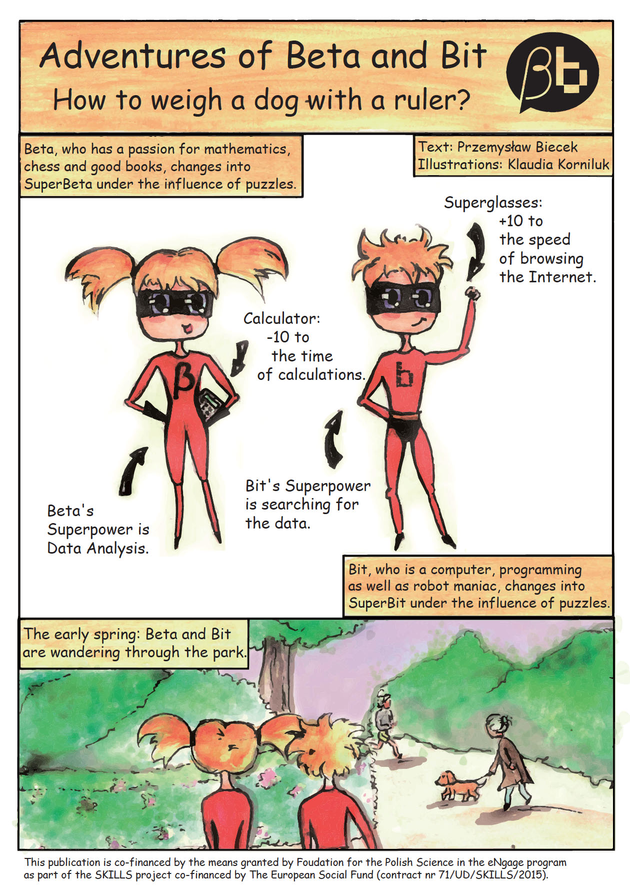
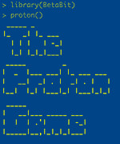

---
output:
  html_document: 
    toc: false
    toc_float: false
title: My work at academia
---

<link rel="stylesheet" href="styles.css" type="text/css">

## Teaching

* Projekt Zesopłowy; Team Project <a href="https://github.com/pbiecek/SystemAnalizyDanych">[2017/2018]</a> <a href="https://github.com/pbiecek/ProjektZespolowy2018">[2018/2019]</a>
* Techniki Wizualizacji Danych ;  Data Visualisation Techniques   [2014/2015] <a href="https://github.com/pbiecek/TechnikiWizualizacjiDanych/tree/master/MINI_2016">[2016/2017]</a> <a href="https://github.com/pbiecek/TechnikiWizualizacjiDanych2018/blob/master/README.md">[2018/2019]</a>
* Seminarium dyplomowe Machine Learning <a href="https://github.com/pbiecek/MachineLearningSeminar">[2017/2018]</a> <a href="https://github.com/pbiecek/MachineLearningSeminar">[2018/2019]</a>
* Programowanie i analiza danych w R dla Zaawansowanych;  Advanced Programming and Data Analysis with R. <a href="https://github.com/pbiecek/AdvancedR2018">[2017/2018]</a>
* Warsztaty Badawcze; Case studies. <a href="github.com/pbiecek/WarsztatyBadawcze2017/blob/master/README.md">[2017/2018]</a>
* Programowanie i Wizualizacja z R; R, Data Visualisation, Programming. <a href="https://github.com/pbiecek/ProgramowanieWizualizacja2017">[2017/2018]</a>  <a href="https://github.com/pbiecek/ProgramowanieWizualizacja/tree/master/MIMUW_2017">[2016/2017]</a>
* Techniki Wizualizacji Danych ;  Data Visualisation Techniques  <a href="https://github.com/pbiecek/TechnikiWizualizacjiDanych2017/blob/master/README.md">[2017/2018]</a>
* Modele liniowe i mieszane; Linear models with fixed and random effects. <a href="https://github.com/pbiecek/LinearModels/tree/master/MIMUW_2015">[2015/2016]</a> <a href="https://github.com/pbiecek/WarsztatyBadawcze/blob/master/MiNI_2017/README.md">[2016/2017]</a>
* Warsztaty Badawcze; Case studies. <a href="https://github.com/pbiecek/WarsztatyBadawcze/tree/master/MiNI_2016">[2015/2016]</a> <a href="https://github.com/pbiecek/WarsztatyBadawcze/blob/master/MiNI_2017/README.md">[2016/2017]</a>
* Statistics II; Exploration, Prediction and Verification. [2015/2016] <a href="https://github.com/pbiecek/StatystykaII/tree/master/MIMUW_2017">[2016/2017]</a>
* Data products; How to build data tools with R. [2015/2016]
* R i Duże Dane / R and Big Data; Shiny, opencpu, HPC, spark, R packages, code profiling, web scrapping, databases. <a href="https://github.com/pbiecek/RandBigData">[2014/2015] [2015/2016]</a>

```{r, eval=FALSE, echo=FALSE}


## Courses at Warsaw University of Technology (MiNI PW)

* 2014Z - Data Visualisation Techniques
* 2015L - R and Big Data
* 2015Z - Data Mining - Advances
* 2016L - (in Polish) Biostatystyka molekularna, analiza dużych danych genetycznych
* 2016L - R and Big Data
* 2016Z - Data Mining - Advances
* 2016Z - Data Visualisation Techniques
* 2017Z - (in Polish) Warsztaty badawcze
* 2017Z - Data Mining - Advances
* 2017Z - Data Visualisation Techniques
* 2018L - Advances in programming and data analysis with R
* 2018L - Team project – development of data analysis system
                
## Courses at University of Warsaw (MIM UW)

* 2012/13, [1000-1D96ST] Statystyka matematyczna i jej zastosowania, seminarium magisterskie
* 2012/13, [1000-1L12SBM] Zastosowania statystyki w biologii i medycynie, proseminarium
* 2012/13, [1000-1S12ZSM] Seminarium badawcze Zakładu Statystyki Matematycznej, seminarium badawcze
* 2012/13, [1000-1S96ST] Statystyka matematyczna i jej zastosowania (sem. mono. wspólnie z 1000-1D96ST), seminarium monograficzne
* 2012/13, [1000-1M12RAS] Pakiety statystyczne: R i SAS
* 2012/13, [1000-1M12MLM] Statystyczna analiza danych: modele liniowe i mieszane z przykładami w programie R
* 2014/15, [1000-225bJNP3] Języki i narzędzia programowania III
*  2015/16, [1000-135ST2] Statystyka II
*  2015/16, [1000-224bJNP2] Języki i narzędzia programowania II
* 2015/16, [1000-1M10MLM] Modele liniowe i mieszane na przykładzie analizy danych biologicznych i medycznych

```


## Github packages

- [DALEX](https://github.com/pbiecek/DALEX) R package: DALEX. Descriptive Model Agnostic EXplanations.
- [archivist](https://github.com/pbiecek/archivist) R package: archivist. Tools for Storing, Restoring and Searching for R Objects.
- [bgmm](https://github.com/pbiecek/bgmm) R package: bgmm. Gaussian Mixture Modeling algorithms. Including the belief-based mixture modeling.
- [intsvy](https://github.com/pbiecek/intsvy) R package: intsvy. International Assessment Data Manager.
- [ddst](https://github.com/pbiecek/ddst) R package: ddst. Data driven smooth tests.
- [PBImisc](https://github.com/pbiecek/PBImisc) R package: PBImisc. Tools and datasets from ,,Modele liniowe i mieszane w R, wraz z przykladami w analizie danych''
- [PIAAC](https://github.com/pbiecek/PIAAC) Dataset from Programme for the International Assessment of Adult Competencies OECD study in R format.
- [PISA2012](https://github.com/pbiecek/PISA2012lite), [PISA2009](https://github.com/pbiecek/PISA2009lite),  [PISA2006](https://github.com/pbiecek/PISA2006lite),  [PISA2003](https://github.com/pbiecek/PISA2003lite),  [PISA2000](https://github.com/pbiecek/PISA2000lite) Datasets from PISA OECD studies in R format.
      	
And lots of other packages that are available at my GitHub account http://github.com/pbiecek

## R for programming, statistics and data vis


,,Przewodnik po pakiecie R'' was my first book. I wrote it in 2007. The first edition was 350+ pages long guide for R language, applied statistics and graphics. It was published in 2008 and now after few years it has 4 major editions. Every few years the book is being updated as the R language evolves. It was fun to write this book it was a first polish book about R and I still get some warm emails about it.

My adventure with R continued. In 2008 I've started a R community in Wroclaw (WZUR) after few years I've started a community in Warsaw [SER](meetup.com/Spotkania-Entuzjastow-R-Warsaw-R-Users-Group-Meetup/) which has now more than 1700+ participants on Meetup. 

In 2015 I've created a massive online open course for R [PogromcyDanych](http://biecek.pl/R/#Pogromcy) and more than 4000 people took part in it.

Find additional materials, errata’s and other sources here: http://biecek.pl/R/.

<br/>

<br/>

<hr/>

## Linear models with fixed, random and mixed effects with R


In the pre-habilitation period I did a lot of studies related to linear and mixed models mostly with collaboration with people from other areas like medicine, oncology or genetics. These collaborations result in lots of interesting use-cases. So in 2011 I gathered selected projects and used them as a skeleton for the ,,Analiza danych z programem R'' book, a companion over linear models with fixed, random and mixed effects.

My interest in mixed models started with lectures of prof. Witold Klonecki, my advisor. It's a very useful set of modeling techniques. Yet these methods are not present in the academic programs in Poland. Thus I hope that this book will introduce them to larger number of data scientists.

Find additional materials, errata’s and other sources here: http://biecek.pl/R/#Analiza.

<br/>

<hr/>

## Essays about data visualisation


,,Eseje o wizualizacji danych'' is my most recent book. It's devoted to data visualization from the point of view of a statistician. 
It was an very interesting project. I self published this book and make it freely available on web http://biecek.pl/Eseje/. It was a risky project in 2013 but no I think it was worth it. 
Lots of interesting experience, many interesting discussions and collaborations initiated from this.
It has a single chapter devoted to Grammar of Graphics that is linked with a single tool. But all other chapters are tool agnostic, they present philosophy and joy that results from good statistical graphics. 

Find additional materials, errata’s and other sources here: http://biecek.pl/R/#Eseje.

<br/>

<br/>

<hr/>

## Blog SmarterPoland 


In my free time I am blogging, mostly about statistics, interesting conferences, events or sources.
Recently I am blogging about my experiences as an academic teacher.
Content of this blog vary a lot as also my interests.

Find the blog here: http://smarterpoland.pl


## Beta Bit

In 2012 I've started Beta and Bit initiative with a simple purpose in mind. Let's create resources that will be interesting for other data-driven people.

The goal is to have fun while playing with data. Today we have some stories, comic books and games. And working on new stuff.

The official website of the project is here: http://betabit.wiki/

Beta loves math, books and puzzles. Bit loves to hack robots, crack passwords and run into troubles. Together they are a team of curious and unstoppable data crunchers getting to know the world around them through the prism of fun with the data.

<hr>

In preparation <a href="https://betaandbit.github.io/KiedyTyWreszcie/indexGrafy.html">,,Tato, kiedy ty mi to wreszcie wytłumaczysz...''</a>.

<hr/>


<b>Pietraszko's Cave</b> by Magda Chudzian is a story about Beta and Bit trapped in the labyrinth of time. In order to return to present times they need to hack the Pietraszko’s time machine.

Translated by Katarzyna Pap.

You can buy the book in [empik](http://www.empik.com/pieczara-pietraszki-chudzian-magdalena-biecek-przemyslaw,p1119203030,ksiazka-p) or in other bookstores.

<br><br> 
<hr/>


<b>How to weight a dog with a ruler?</b> is the first comic books about Beta and Bit. Learn how to estimate the weight of T-Rex dinosaur with the use of linear regression!

Illustrated by Klaudia Korniluk.

Translated by Witold Chodor.

Download the pdf from [this page](http://betabit.wiki/story/HeavyDog.pdf).

<br>

<hr/>


<b>Ready to hack the Pietraszko's password? </b>The Proton Game is a text based R console game. Just install and load the BetaBit package from CRAN.

```
install.packages("BetaBit")
library("BetaBit")
proton()
```

