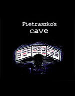

---
output:
  html_document: 
    toc: false
---

<link rel="stylesheet" href="styles.css" type="text/css">

## Beta Bit

In 2012 I've started Beta and Bit initiative with a simple purpose in mind. Let's create resources that will be interesting for other data-driven people.

The goal is to have fun while playing with data. Today we have some stories, comic books and games. And working on new stuff.

The official website of the project is here: http://betabit.wiki/

Beta loves math, books and puzzles. Bit loves to hack robots, crack passwords and run into troubles. Together they are a team of curious and unstoppable data crunchers getting to know the world around them through the prism of fun with the data.

<hr>

In preparation <a href="https://betaandbit.github.io/KiedyTyWreszcie/indexGrafy.html">,,Tato, kiedy ty mi to wreszcie wytłumaczysz...''</a>.

<hr/>


<b>Pietraszko's Cave</b> by Magda Chudzian is a story about Beta and Bit trapped in the labyrinth of time. In order to return to present times they need to hack the Pietraszko’s time machine.

Translated by Katarzyna Pap.

You can buy the book in [empik](http://www.empik.com/pieczara-pietraszki-chudzian-magdalena-biecek-przemyslaw,p1119203030,ksiazka-p) or in other bookstores.

<br><br> 
<hr/>


<b>How to weight a dog with a ruler?</b> is the first comic books about Beta and Bit. Learn how to estimate the weight of T-Rex dinosaur with the use of linear regression!

Illustrated by Klaudia Korniluk.

Translated by Witold Chodor.

Download the pdf from [this page](http://betabit.wiki/story/HeavyDog.pdf).

<br>

<hr/>


<b>Ready to hack the Pietraszko's password? </b>The Proton Game is a text based R console game. Just install and load the BetaBit package from CRAN.

```
install.packages("BetaBit")
library("BetaBit")
proton()
```