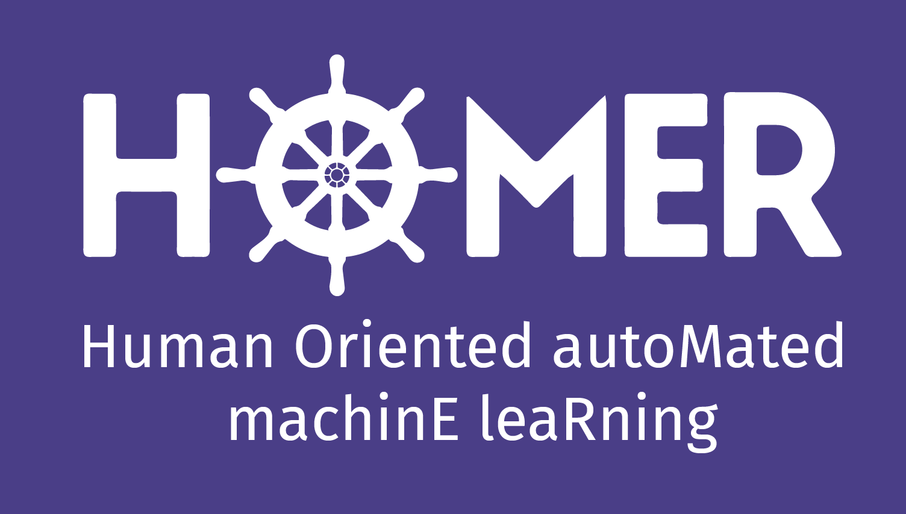

---
output:
  html_document: 
    toc: true
    toc_float: false
title: Call for collaborators 
---

<link rel="stylesheet" href="styles.css" type="text/css">

## xLungs - Responsible Artificial Intelligence for Lung Diseases

Where: [MI2DataLab](http://mi2.mini.pw.edu.pl/) at [Warsaw University of Technology](https://www.mini.pw.edu.pl/). 

What:

The aim of the project is to support the process of identification of lesions visible on CT and lung x-rays. We intend to achieve this goal by building an information system based on artificial intelligence (AI) that will support the radiologist’s work by enriching the images with additional information.

### Research software engineer 

List of open positions is available here: https://www.mi2.ai/positions.html

## HOMER - Human Oriented autoMated machinE leaRning

Where: [MI2DataLab](http://mi2.mini.pw.edu.pl/) at [Warsaw University of Technology](https://www.mini.pw.edu.pl/). Our [GitHub](https://github.com/ModelOriented/).

With whom: Przemysław Biecek [Google Scholar](https://scholar.google.com/citations?user=Af0O75cAAAAJ), [GitHub](https://github.com/pbiecek/). 

What:

Machine learning models are used everywhere. Predictive modelling fundamentally changed data-
driven disciplines like health-care, biology, finance, legal, military, security, transportation, and many
more. The increasing availability of large annotated data sources combined with recent developments in
machine learning models leads to the next industrial revolution.

**BUT: **Predictive models are handcrafted by data scientists in a tedious and laborious process.
Most of the time spent on data exploration and model training is a set of try-and-error experiments.
Models become more and more complex to catch even vague signals. Techniques like boosting, bagging
or neural networks result in models with thousands or millions of parameters. Lack of understanding
of complex models and poor automation results in problems with replicability and quality of models.

**The main goal of this project is to develop new methods for human-oriented model exploration, interpretable model audits and automated model assembly. The newly appointed research team will create a grammar for human - model interaction.**

### Research software engineer / Post-doc / PhD student

List of open positions is available here: https://www.mi2.ai/positions.html

## How to apply?

Send 

* your resume
* your best publication
* link to your best software project
* other relevant information

to Przemyslaw.Biecek at gmail.
