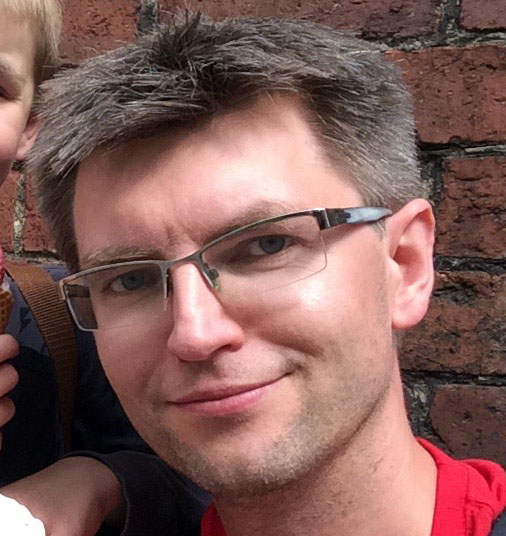

---
---

<link rel="stylesheet" href="styles.css" type="text/css">

Data Scientist with background in both mathematical statistics [PAM@WUST](http://wmat.pwr.edu.pl/en/) and software engineering [CSM@WUST](http://wiz.pwr.edu.pl/en/).

I work as associate professor [MiNI@Warsaw University of Technology](http://mini.pw.edu.pl) and assistant professor [MIM@Univeristy of Warsaw](http://mimuw.edu.pl).

I am interested in predictive modeling of large and complex data, data visualisation and model interepretability.
Research activities are mainly focused on high-throughput genetic profiling in oncology. 
Also I'm interested in evidence based education, evidence based medicine, general machine learning modeling and statistical software engineering (an R enthusiast).
Big believer of data-literacy education for kids.

My CV is available [here](http://biecek.pl/CV).

I am a data-driven person got it from my advisors. My PhD advisor in math was [Prof. Witold Klonecki](http://www.ibspan.waw.pl/komisja.statystyki/wspomnienia/Klonecki.pdf). His PhD advisor was [Julian Perkal](https://pl.wikipedia.org/wiki/Julian_Perkal). And his PhD advisor was [Hugo Steinhaus](https://pl.wikipedia.org/wiki/Hugo_Steinhaus). And his advisor was [David Hilbert](https://en.wikipedia.org/wiki/David_Hilbert). My PhD advisor in biology was [Prof. Stanislaw Cebrat](https://pl.wikipedia.org/wiki/Stanis%C5%82aw_Cebrat).

I like travels, board games, audiobooks and hiking. Living in Warsaw with my wife and two kids.
