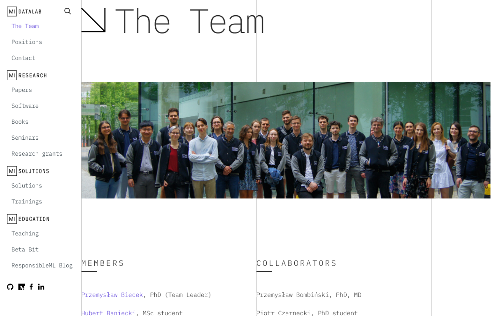

---
output:
  html_document: 
    toc: false
    toc_float: false
title: MI^2 - MI2DataLab
---

<link rel="stylesheet" href="styles.css" type="text/css">

I lead MI^2 group of data enthusiasts, mostly MSc and PhD students. People here are from Math and Computer Science departments from University of Warsaw or Warsaw University of Technology.
Together we create tools, try new methods and look for interesting opportunities to squeeze useful information from vast amount of data.

Find out about the team, projects and initiatives at https://mi2.ai/.

 

