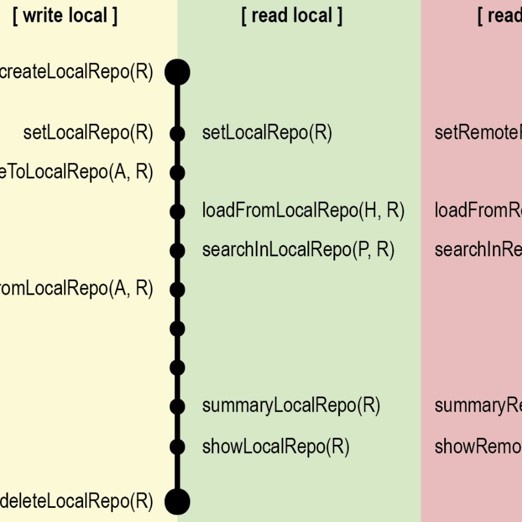

---
output:
  html_document: 
    toc: false
    toc_float: false
---

<link rel="stylesheet" href="styles.css" type="text/css">

## Latest projects

<table class="tg">
  <tr>
    <th class="tg-8jgo"> Paper and package: <a href="http://dalex.drwhy.ai/">XAI with DALEX for R and Python</a></th>
    <th class="tg-8jgo"> Book: <a href="https://pbiecek.github.io/ema/">Explanatory Model Analysis</a></th>
    <th class="tg-8jgo"> Package: <a href="https://modeloriented.github.io/fairmodels/">Fairness with fairmodels</a></th>
    <th class="tg-8jgo"> Paper: <a href="http://xai-tools.drwhy.ai/">Landscape of R packages for XAI</a></th>
  </tr>
  <tr>
    <th class="tg-8jgo"> Software: <a href="https://crs19.pl/">COVID-19 Risk Score</a></th>
    <th class="tg-8jgo"> Paper: <a href="https://rai-covid.drwhy.ai/">Responsible ML for COVID-19</a></th>
    <th class="tg-8jgo"> Paper and package: <a href="https://github.com/pbiecek/archivist">Model governance with R (MLOps)</a></th>
  </tr>
</table>

## MI^2

I lead MI^2 group of data enthusiasts, mostly MSc and PhD students. People here are from Math and Computer Science departments from University of Warsaw or Warsaw University of Technology.
Together we create tools, try new methods and look for interesting opportunities to squeeze useful information from vast amount of data.

We have quite nice MI2DataLab, place in which we have workshops, seminars and some experiments.
Feel free to jump in.

Here is our webpage: http://mi2.mini.pw.edu.pl

Here is our GitHub account: http://github.com/MI2DataLab/

## Recent projects

I am involved in differnet projects, but the two that are closes to may heart are:

* `DALEX` is an R package but is also a way of thinking about complex black-box models so common in machine learning. It is a set of techniques that may be used to better understand the model, validate, improve the model or simply audit it's results [GitHub website](https://github.com/pbiecek/DALEX)
* `archivist` is an R package but is also a different way of thinking about objects. Here they are not transient but persistent, have hooks, relations, can be called, traced and audited if necessary. [GitHub website](https://github.com/pbiecek/archivist)

## Talks

My talks, workshops and other materials are avaliable here: https://github.com/pbiecek/Talks

In 2012 I gave a talk at TEDxKrakow. It was a big thing for me. Find it here https://www.youtube.com/watch?v=UEIcsVhFaSs.

## Publications

It is so hard to keep the list of publications updated. 

Please use rather [Google scholar](https://scholar.google.pl/citations?user=Af0O75cAAAAJ) or [this site](http://biecek.pl/CV/#Publications).

